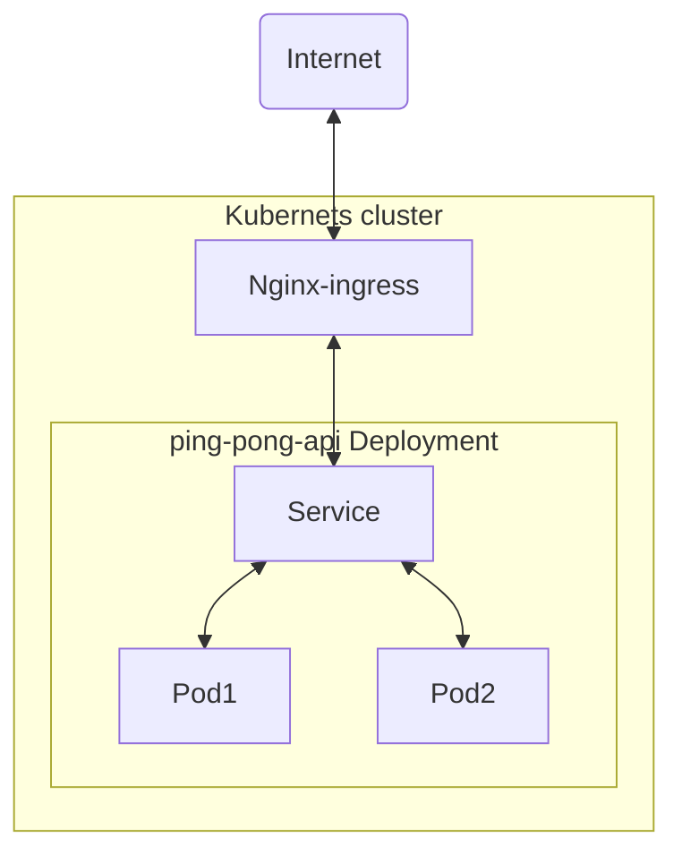

# Ping Pong API

## Endpoints

- /ping - Responds with {'pong'}
- /pong - Responds with {'ping'}
- /professional-ping-pong - Responds with {'pong'} 90% of the time
- /amateur-ping-pong - Responds with {'pong'} 70% of the time
- /chance-ping-pong - Responds with {'ping'} 50% of the time and {'pong'} 50% of the time

## Description

This is a simple API to test that the RapidAPI/Mashape API Proxy is working. When you access /ping,
the API will return a JSON that contains "pong"

## Test Endpoints

## Locally

> Prerequisites
> nodejs >18

```shell
# Run locally
make run
```

### In rapidapi

API is live at https://rapidapi.com/user/RapidAlex/package/ping-pong

### In Docker

> Prerequisites
>
> - GNU make >4.3
> - git >2.30.2
> - docker >20.10.21
> - docker compose >v2.12.2
>
> ```shell
> ## Setup docker buildx
> make enable-docker-buildx
> ```

```shell
## Run container in background
make docker-run
## Default running localhost 3000
open localhost:3000
## Clean everything
make docker-clean
```

### In Kubernetes



> Prerequisites
>
> - GNU make >4.3
> - git >2.30.2
> - docker >20.10.21
> - kubectl >1.25
> - GNU curl
>
> ```shell
> ## Setup docker buildx
> make create-k8s-cluster
> ```

- For TLS, assuming `cluster-issuer` and `cert-manager` already there, Configure `cert-manager.io/cluster-issuer` and uncomment/enable `kubernetes.io/tls-acme` and `.spec.tls` in [ingress.yaml](k8s/ingress.yaml)

- For request affinity, uncomment/enable `nginx.ingress.kubernetes.io/*` in [ingress.yaml](k8s/ingress.yaml)

- For request timeouts, uncomment/enable and configure `nginx.ingress.kubernetes.io/proxy-*` in [ingress.yaml](k8s/ingress.yaml)

- Configure `spec.rules.host[]` for proper ingress routing

```shell
## Run container in background
make k8s-apply
## Test
curl -H "Host: ping-pong-api.pratikb.in" localhost/ping
## Delete deployment and cluster
make k8s-clean delete-cluster
```

## Other Useful commands

- Check all the ncessery tools exist

  ```shell
  make check-all
  ```

- Customize parameters

  ```shell
  ## Custom docker registry
  make docker-push DOCKER_REGISTRY=<custom docker registry>

  ## Custom docker tag
  make docker-push DOCKER_TAG_NAME=master

  ## custom image name
  make docker-push DOCKER_IMAGE_NAME=localhost/ping-only
  ```

- Push non-prod docker image

  ```shell
  ## Image with tag `edge`
  make docker-push
  ```

- Push Prod docker image

  ```shell
  ## Note: here we've used git commit SHA as suffix to latest tag e.g. `latest-xxxxxxxx`
  ## Below command will push both `latest` and `latest-xxxxxxxx`
  make docker-push-prod
  ```

### Assumptions

- Assuming application is stateless
- Assuming tools versions are available in system
  - nodejs ~18
  - GNU make >4.3
  - git >2.30.2
  - docker >20.10.21
  - docker compose >2.12.2
  - kubectl >1.25
- Docker
  - Added healthchecks/rediness-prob in docker compose
- Kubernetes
  - Images are loaded from local so no need to push into
  - Autoscaler
    - Configured [Horizontal autoscaler](k8s/hpa.yaml) to trigger and incrase max replicas upto 5 if CPU utilization all Pods goes above 80%
  - Added rediness prob in path `/ping` in deployment
  - Installing [nginx ingress controller](https://github.com/kubernetes/ingress-nginx) when setting up cluster, setting up `ingressClassName: nginx` [ingress.yaml](k8s/ingress.yaml), Assuming port 80 and 443 are free, if not change `hostPort:` from [kind.sh](./kind.sh)
  - Ingress host `ping-pong-api.pratikb.in`
